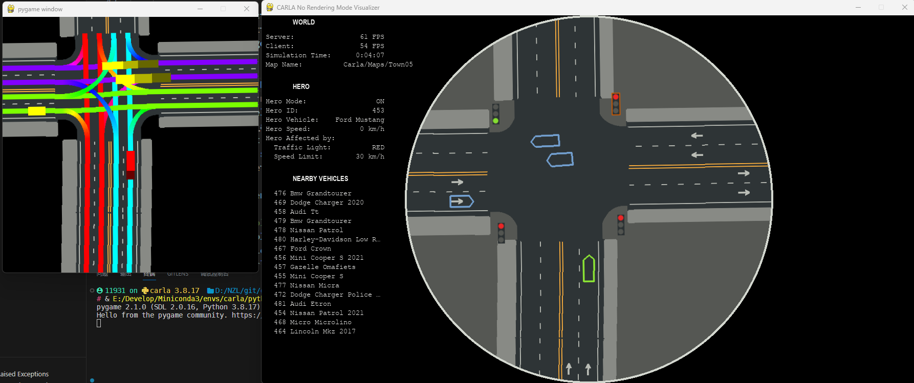
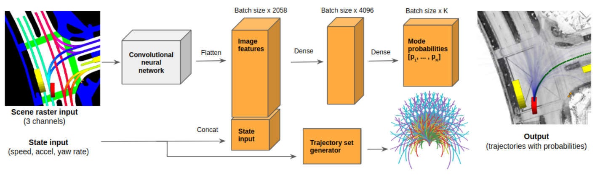

# Carla_nuScenes_BEV

## Overview

Create nuScenes-inspired bird's-eye view (BEV) images using the Carla Simulator.



(Left: Carla_nuScenes_BEV, Right: no_rendering_mode provided by Carla/PythonAPI)

## Motivation

The nuScenes dataset has become a staple in the autonomous vehicle and robotics community for developing and benchmarking algorithms. However, generating similar rasterized bird's-eye view images in a simulation environment like Carla is not straight-forward.



The Carla_nuScenes_BEV repository aims to bridge this gap by providing a simple, efficient, and customizable way to generate nuScenes-style bird's-eye view images in the Carla Simulator.

## Usage

### Quick Start

1. The core functionality is contained in the [`BirdeyeRender`](./birdeye_render.py) class. You can easily integrate it into your codebase with the provided [`BEVGenerator`](./birdeye_generator.py) module. Here's a quick example to get you started:

    ```python
    bev_gen = BEVGenerator(hero_actor)
    image = bev_gen.render()

    # Visualize with matplotlib
    plt.imshow(image)
    plt.show()
    ```

> Note: the first run on each map could take some time, as we need to parse the OpenDrive file to gain a full-view of the map.
> 
> We will cache the rendered result in png format, so that on the next run, we could simply load the layer.

### Advanced Usage

1. For those interested in generating a continuous stream of BEV frames during a running episode in Carla, refer to the example script [`test.py`](./examples/test.py).

2. If you have specific needs, feel free to extend or wrap the `BirdeyeRender` class for greater flexibility.

## TODO

### Future Enhancements

1. Currently, the rendering process relies solely on the Pygame library. Exploring alternative rendering engines for improved performance is on the roadmap.
  
2. Investigate the feasibility and benefits of switching to OpenCV for image manipulation and rendering.

3. Implement a more efficient caching mechanism to speed up frame rendering.
